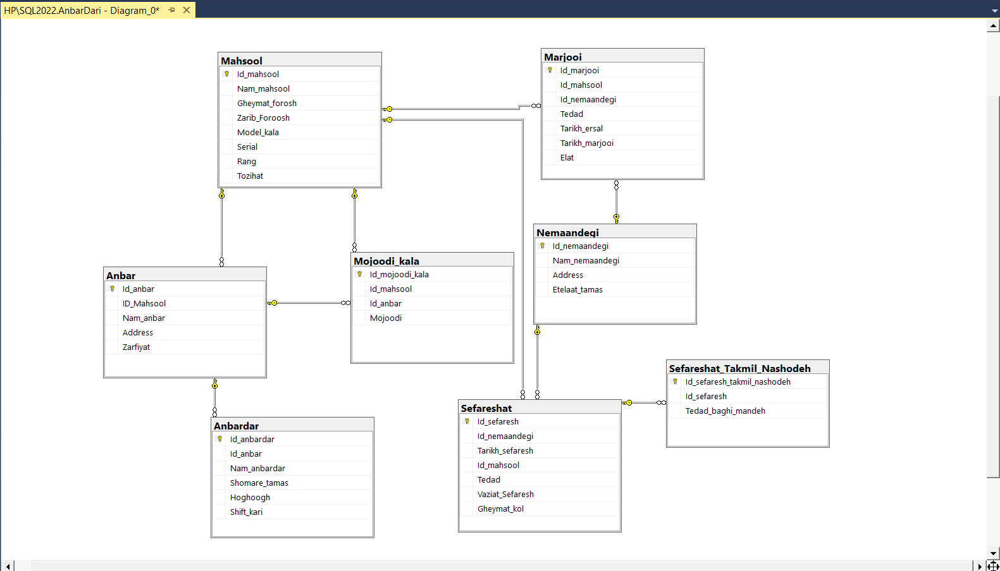

# inventory-management-database
A normalized SQL Server inventory management database including entities for warehouses, products, staff, returns, stock levels, and incomplete orders.

# دیتابیس سیستم انبارداری (SQL Server)

این پروژه شامل یک دیتابیس ساختاریافته و نرمال‌سازی‌شده برای مدیریت انبارها با استفاده از SQL Server است. طراحی این پایگاه داده به‌گونه‌ای است که سناریوی واقعی یک سیستم انبارداری را شبیه‌سازی می‌کند و داده‌های مربوط به انبارها، محصولات، کارکنان، مرجوعی‌ها، موجودی کالا و سفارشات نمایندگی‌ها را مدیریت می‌کند. این سیستم مناسب برای اهداف آموزشی، پروژه‌های دانشگاهی و یا ادغام در سیستم‌های بزرگ‌تر مدیریت موجودی می‌باشد.

---

## 📁 فایل‌های موجود در پروژه

- `AnbarDari-Diagram.png` – تصویر نمودار موجودیت-رابطه (ERD)
- `AnbarDari Create Table's.sql` – اسکریپت ایجاد جداول
- `AnbarDari Insert Table's.sql` – دستورات درج نمونه داده
- `AnbarDari Querie's.sql` – نمونه کوئری‌ها برای گزارش‌گیری

---

## 🧱 ساختار دیتابیس

### 🏢 `Anbar` – انبارها  
اطلاعات مربوط به شعب مختلف انبار (مثلاً انبار غرب، شرق و ...) شامل:  
- آدرس  
- ظرفیت  
- کالاهای نگهداری‌شده (ID محصولات)

### 👷 `Anbardar` – انباردارها  
اطلاعات کارکنان انبار شامل:  
- نام و شماره تماس  
- حقوق  
- شیفت کاری  
- شناسه انباری که در آن مشغول هستند

### 📦 `Mahsool` – محصولات  
اطلاعات مربوط به هر محصول شامل:  
- نام  
- قیمت  
- ضریب فروش  
- مدل و رنگ

### 🔁 `Marjooi` – مرجوعی‌ها  
مدیریت کالاهای مرجوع‌شده توسط نمایندگی‌ها:  
- شناسه محصول  
- تعداد  
- تاریخ  
- علت مرجوعی  
- شناسه نمایندگی

### 📊 `Mojoodi_kala` – موجودی کالا  
تعداد کالای موجود در هر انبار:  
- شناسه انبار  
- شناسه محصول  
- تعداد موجودی

### 🏪 `Nemaandegi` – نمایندگی‌ها  
اطلاعات تماس و مشخصات نمایندگی‌ها شامل:  
- نام  
- آدرس  
- شماره تماس

### 📑 `Sefareshat` – سفارشات  
لیست سفارشات ارسال‌شده از نمایندگی‌ها شامل:  
- شناسه کالا  
- تعداد  
- وضعیت سفارش  
- تاریخ سفارش  
- مبلغ کل فاکتور
- ایدی نمایندگی ( سفارش دهنده )

### ⛔ `Sefareshat_Takmil_Nashodeh` – سفارشات تکمیل‌نشده  
ردیابی سفارشاتی که به‌طور کامل ارسال نشده‌اند:  
- شناسه سفارش  
- تعداد کالای ارسال‌نشده

---

## ⚙️ نحوه استفاده

1. فایل‌های SQL زیر را به‌ترتیب در SQL Server اجرا کنید:
   - `AnbarDari Create Table's.sql`
   - `AnbarDari Insert Table's.sql`
2. از فایل `AnbarDari Querie's.sql` برای اجرای گزارشات زیر استفاده کنید:
   - بررسی موجودی کالاها در انبارها  
   - مشاهده سفارشات تکمیل‌نشده  
   - محاسبه ارزش کالاهای مرجوع‌شده  
   - مشاهده لیست انبارداران به تفکیک انبار

---

## 📌 مجوز استفاده (License)

این پروژه تحت مجوز MIT منتشر شده است. شما می‌توانید آزادانه از آن برای اهداف آموزشی یا تجاری استفاده کرده، آن را تغییر داده یا توسعه دهید.

---

## 🖼️ پیش‌نمایش نمودار ERD

